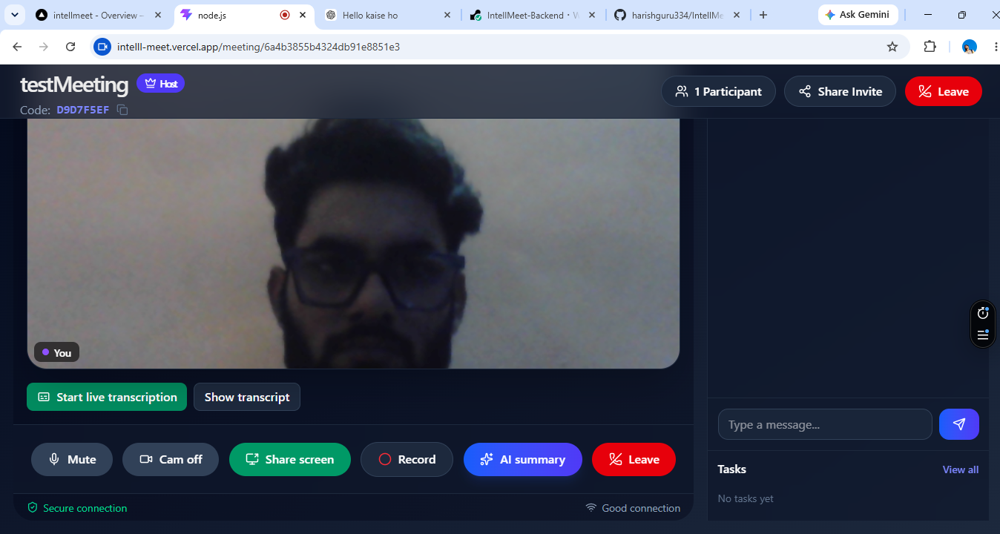
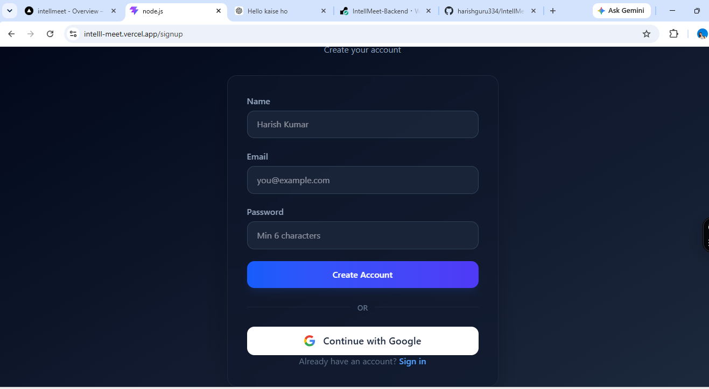
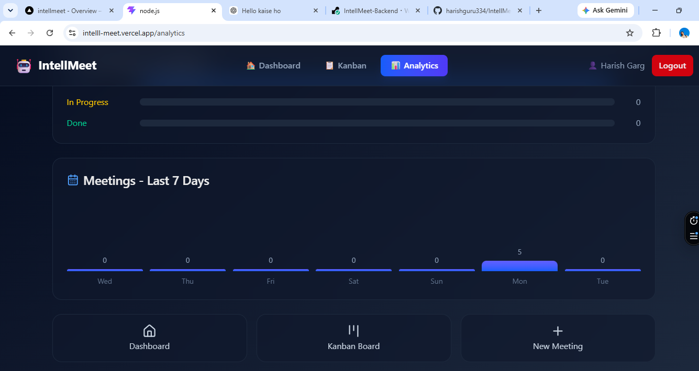
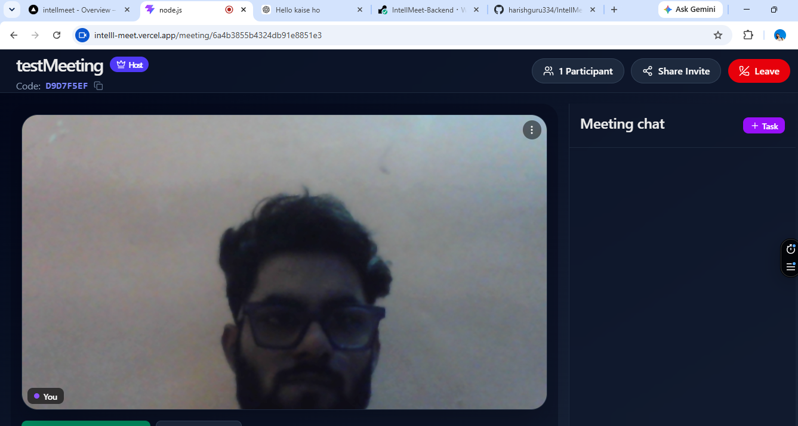
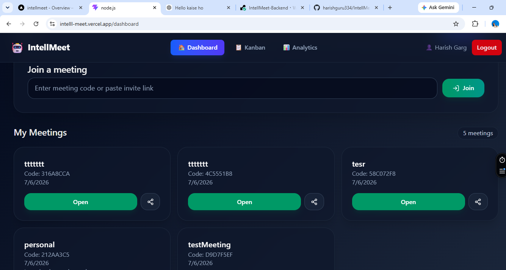
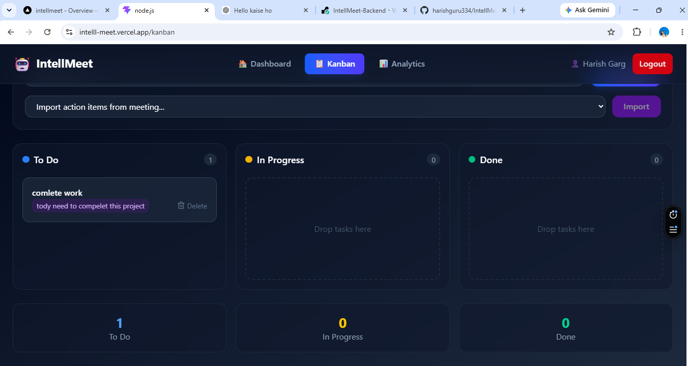

# 🚀 IntellMeet - Frontend

An AI-powered real-time meeting and collaboration platform built with the MERN Stack. IntellMeet enables users to conduct secure video meetings, collaborate in real time, generate AI-powered meeting summaries, manage tasks, and analyze productivity.

---

## 📌 Features

- 🔐 JWT Authentication
- 🔑 Google OAuth Login
- 🎥 Real-time Video Meetings
- 💬 Live Chat
- 🖥️ Screen Sharing
- 🤖 AI Meeting Summary
- 📝 Live Transcription
- ✅ Meeting Task Management
- 📋 Kanban Board
- 📊 Analytics Dashboard
- 📱 Responsive Design

---

## 🛠️ Tech Stack

- React.js
- Vite
- Tailwind CSS
- React Router DOM
- Axios
- Socket.IO Client
- PeerJS
- Lucide React
- React Hot Toast

---

## 📂 Folder Structure

```text
src
│
├── Api
├── Assets
├── Components
├── Context
├── Pages
├── Socket
├── App.jsx
├── main.jsx
└── index.css
```

---

## ⚙️ Installation

### Clone Repository

```bash
git clone:- https://github.com/harishguru334/IntellMeet-Frontend
```

### Go to Project Folder

```bash
cd IntellMeet
```

### Install Dependencies

```bash
npm install
```

### Start Development Server

```bash
npm run dev
```

---

## 🌍 Environment Variables

Create a `.env` file in the root directory.

```env
VITE_API_URL=https://intellmeet-backend-hf1k.onrender.com/api
```

---

## 🚀 Main Features

### Authentication

- User Registration
- User Login
- Google OAuth
- JWT Authentication
- Protected Routes

### Dashboard

- Create Meeting
- Join Meeting
- Meeting History

### Meeting Room

- Video Calling
- Audio Controls
- Screen Sharing
- Live Chat
- Participant List

### AI Features

- Live Transcription
- AI Meeting Summary
- Action Items Extraction

### Task Management

- Create Tasks
- Update Task Status
- Kanban Board

### Analytics

- Total Meetings
- AI Summaries
- Task Statistics
- Productivity Insights

---

## 📸 Screenshots

### Login


### Dashboard


### Meeting Room


### Meeting Chat


### Kanban Board


### Analytics


## 📦 Build

```bash
npm run build
```

---

## 🚀 Deployment

Frontend is deployed on **vercel**.

---

## 👨‍💻 Author

**Harish Garg**

---

## 📄 License

This project was developed as part of the **Zidio Development Internship Program**.
